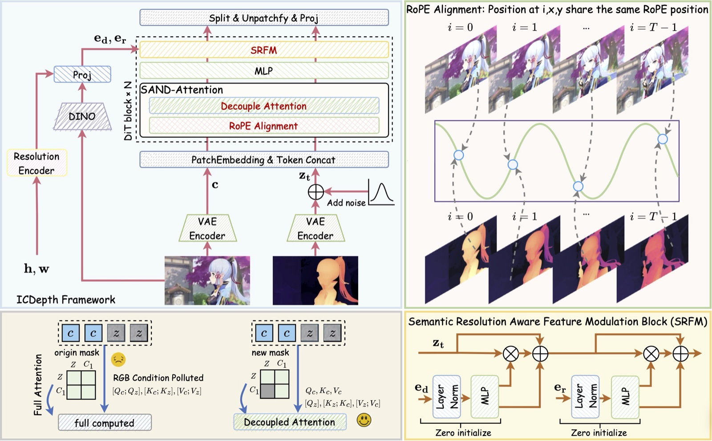

# ICDepth: Taming Video Diffusion Models for Video Depth Estimation via In-Context Conditioning

<p align="center">
  <a href="https://arxiv.org/abs/2607.01677"></a>
  <a href="https://xuanhuahe.github.io/ICDepth/"></a>
  <a href="https://huggingface.co/Alexhe101/WanxDepth"></a>
</p>

<p align="center">
  <a href="https://xuanhuahe.github.io/">Xuanhua He</a><sup>*</sup>,
  <a href="https://jiaxinxie97.github.io/Jiaxin-Xie/">Jiaxin Xie</a><sup>*</sup>,
  <a href="https://scholar.google.com/citations?user=U6bikksAAAAJ">Mingzhe Zheng</a>,
  <a href="https://cqf.io/">Qifeng Chen</a><sup>&dagger;</sup>
  <br>
  The Hong Kong University of Science and Technology
  <br>
  <b>ECCV 2026</b>
  <br>
  <sup>*</sup>Equal contribution &nbsp; <sup>&dagger;</sup>Corresponding author
</p>

ICDepth turns the Wan2.1 text-to-video diffusion transformer into a video depth estimator. The RGB video is fed to the model as clean in-context tokens next to the noisy depth tokens, so the pretrained 3D attention relates the two modalities directly. Two components adapt this in-context conditioning to dense prediction:

- **SAND-Attention.** Depth and RGB tokens share RoPE positions, depth tokens attend to the RGB tokens but not the other way around, and RGB tokens use a zero timestep, so noise never reaches the condition.
- **SRFM.** DINOv2 features and an embedding of the resolution modulate the DiT features after every block.

Trained on 0.8M synthetic frames, ICDepth achieves state-of-the-art zero-shot results on Sintel, KITTI and Bonn and handles videos up to 1080p with arbitrary aspect ratios.

<p align="center"></p>

## Installation

```bash
git clone https://github.com/alexhe101/ICDepth.git
cd ICDepth
conda create -n icdepth python=3.10 -y
conda activate icdepth
# Install PyTorch >= 2.1 for your CUDA version (https://pytorch.org), then:
pip install -e .
# Optional, for faster attention:
pip install flash-attn --no-build-isolation
```

## Model weights

```bash
bash scripts/download_models.sh          # add --train to also download the training initialization
```

| Model | Local path | Source | License |
| --- | --- | --- | --- |
| Wan2.1 text encoder, VAE and tokenizer | `models/Wan-AI/Wan2.1-T2V-1.3B/` | [Wan-AI/Wan2.1-T2V-1.3B](https://huggingface.co/Wan-AI/Wan2.1-T2V-1.3B) | Apache-2.0 |
| DINOv2 ViT-L encoder | `models/depth-anything/Video-Depth-Anything-Large/video_depth_anything_vitl.pth` | [depth-anything/Video-Depth-Anything-Large](https://huggingface.co/depth-anything/Video-Depth-Anything-Large) | CC-BY-NC-4.0 |
| ICDepth | `models/ICDepth/checkpoints/Wan2.1-depth-1212_with_quant_epoch-5.safetensors` | [Alexhe101/WanxDepth](https://huggingface.co/Alexhe101/WanxDepth) | CC-BY-NC-4.0 |
| ICC base (training only) | `models/ICDepth/depth_in_context.safetensors` | [Alexhe101/WanxDepth](https://huggingface.co/Alexhe101/WanxDepth) | CC-BY-NC-4.0 |

The ICDepth model repository asks you to accept its access conditions. Request access on its page and run `hf auth login` before downloading.

## Inference

```bash
python inference.py --input path/to/video.mp4 --output_dir outputs
python inference.py --input path/to/videos/ --output_dir outputs     # every video in a folder
```

For each video, ICDepth writes:

- `<name>_depth.mp4`: depth visualization with the inferno colormap (brighter is closer).
- `<name>_disparity.npz`: a float32 array `disparity` of shape (T, H, W) at the inference resolution, holding relative (affine-invariant) disparity in [0, 1].

Useful options:

- `--max_side` (default 1024) limits the longer side of the inference resolution. The aspect ratio is kept and both sides are rounded to multiples of 16. Use `--height` and `--width` to set the resolution explicitly.
- `--window_size` and `--overlap` (default 101 and 64 frames). Longer videos are denoised in overlapping windows that are aligned and blended in latent space.
- `--steps` (default 5). More steps lower AbsRel on Sintel at a higher cost (Table 7 of the paper).
- `--use_kv_cache` reuses the RGB keys and values after the first step, which speeds up videos that fit in one window.
- `--tiled` enables tiled VAE encoding and decoding for high resolutions.

At 480x640 with 53 frames, inference needs about 11 GB of GPU memory (Table 6 of the paper).

The pipeline can also be used from Python:

```python
import torch
from icdepth import ICDepthPipeline, ModelManager, VideoData

manager = ModelManager(torch_dtype=torch.bfloat16, device="cuda")
manager.load_models([
    "models/ICDepth/checkpoints/Wan2.1-depth-1212_with_quant_epoch-5.safetensors",
    "models/Wan-AI/Wan2.1-T2V-1.3B/models_t5_umt5-xxl-enc-bf16.pth",
    "models/Wan-AI/Wan2.1-T2V-1.3B/Wan2.1_VAE.pth",
])
pipe = ICDepthPipeline.from_model_manager(manager)
pipe.enable_vram_management()

video = VideoData("video.mp4", height=480, width=832)
frames = [video[i] for i in range(len(video))]
depth_vis, disparity = pipe(video=frames, height=480, width=832, seed=42, window_size=101, overlap=64)
```

## Evaluation

We follow the protocol of [DepthCrafter](https://github.com/Tencent/DepthCrafter) and score predictions with its official evaluation script.

1. Clone DepthCrafter and prepare Sintel, ScanNet, KITTI and Bonn with the scripts in its `benchmark/dataset_extract/`. They write the videos and ground truth to `DepthCrafter/benchmark/datasets/`.
2. From the root of this repository, run inference and evaluation for all four datasets:

   ```bash
   bash benchmark/run.sh /path/to/DepthCrafter /path/to/DepthCrafter/benchmark/datasets outputs/benchmark
   ```

   Metrics are saved to `outputs/benchmark/results_<dataset>.json`. `benchmark/infer.py --dataset <name>` runs the inference for a single dataset.

| Dataset | Resolution | Frames per clip | KV cache |
| --- | --- | --- | --- |
| Sintel | 448x1056 | 53 | no |
| ScanNet | 480x640 | 93 | yes |
| KITTI | 400x1328 | 113 | yes |
| Bonn | 480x640 | 113 | no |

All benchmarks use 5 sampling steps, a CFG scale of 5.0 and seed 42. Clips shorter than the listed length are padded with their last frame.

Zero-shot results (Table 1 of the paper):

| Method | Sintel AbsRel&darr; | Sintel &delta;<sub>1</sub>&uarr; | ScanNet AbsRel&darr; | ScanNet &delta;<sub>1</sub>&uarr; | KITTI AbsRel&darr; | KITTI &delta;<sub>1</sub>&uarr; | Bonn AbsRel&darr; | Bonn &delta;<sub>1</sub>&uarr; | Training data |
| --- | --- | --- | --- | --- | --- | --- | --- | --- | --- |
| Depth Anything V2 | 0.403 | 0.547 | 0.123 | 0.852 | 0.102 | 0.910 | 0.084 | 0.947 | 62.62M |
| Video Depth Anything | 0.383 | 0.629 | **0.075** | **0.954** | 0.078 | 0.950 | **0.053** | 0.975 | 1.35M |
| ChronoDepth | 0.587 | 0.486 | 0.159 | 0.783 | 0.167 | 0.759 | 0.100 | 0.911 | - |
| DepthCrafter | 0.313 | 0.680 | 0.142 | 0.803 | 0.105 | 0.898 | 0.066 | 0.971 | 10.5M |
| Depth Any Video | 0.300 | 0.643 | 0.119 | 0.865 | 0.098 | 0.925 | 0.063 | 0.963 | 6M |
| **ICDepth** | **0.250** | **0.749** | 0.076 | 0.952 | **0.061** | **0.968** | **0.053** | **0.979** | 0.8M |

## Training

### Data

Training reads a CSV file with one row per video clip:

| Column | Description |
| --- | --- |
| `reference_video` | RGB video file. |
| `depth_video` | Depth in meters as a `.npz` or `.npy` array of shape (T, H, W), frame-aligned with the video. |
| `height`, `width` | Optional original resolution, used to choose the training resolution without opening the depth file. |
| `prompt` | Optional. Defaults to `Estimate the depth`. |

Relative paths are resolved against `--dataset_base_path`. Pixels with non-finite depth, depth below 0.001 m or above 200 m (`--max_depth`) are excluded from the loss. Depth is converted to disparity and normalized to [-1, 1] per clip with its 2% and 98% quantiles.

Each clip is resized and center-cropped to the largest of the following resolutions that does not upsample it. Its length follows a token budget of 384x672x77, and the start frame is sampled at random: 1056x1920 (9 frames), 992x992 (17), 704x1280 (21), 768x1024 (1), 640x640 (45), 352x1152 (49), 480x640 (61), 384x672 (77) and 368x640 (77).

The released model was trained on Virtual KITTI 2, subsets of TartanAir and TartanGround (single-direction cameras) and the synthetic subset of OmniWorld, about 0.8M frames in total.

### Launch

```bash
bash scripts/download_models.sh --train
bash scripts/train.sh /path/to/train.csv outputs/train
```

Training starts from `depth_in_context.safetensors`, a Wan2.1-1.3B in-context conditioning checkpoint. The DINOv2 and resolution modulation layers are added with zero initialization, so the initial model reproduces the base checkpoint. `scripts/train.sh` trains on 4 GPUs (change with `NUM_GPUS`) with batch size 1 per GPU, 64 gradient accumulation steps, AdamW with a learning rate of 6.67e-5, bf16 mixed precision and 8 epochs. Each GPU needs at least 40 GB of memory.

Checkpoints are saved every 2,000 iterations and at the end of every epoch, and can be used directly with `inference.py --checkpoint`. To fine-tune the released model instead, pass its checkpoint to `train.py --dit_path`.

## Repository structure

```text
icdepth/
├── models/wan_video_dit.py           # Wan2.1 DiT with in-context conditioning, SAND-Attention and SRFM
├── models/dino_feature_extractor.py  # DINOv2 features for SRFM
├── models/dinov2/                    # DINOv2 encoder from Video Depth Anything
├── pipelines/icdepth.py              # inference pipeline and training loss
└── trainers/                         # training dataset and loop
inference.py                          # depth estimation for your own videos
benchmark/                            # Sintel, ScanNet, KITTI and Bonn evaluation
train.py, scripts/train.sh            # training
tests/                                # CPU unit tests (python -m pytest tests)
```

## Citation

```bibtex
@inproceedings{he2026icdepth,
  title     = {ICDepth: Taming Video Diffusion Models for Video Depth Estimation via In-Context Conditioning},
  author    = {He, Xuanhua and Xie, Jiaxin and Zheng, Mingzhe and Chen, Qifeng},
  booktitle = {European Conference on Computer Vision (ECCV)},
  year      = {2026}
}
```

## License

The code is released under the [Apache License 2.0](LICENSE). It is based on DiffSynth-Studio and includes the DINOv2 encoder code of Video Depth Anything; see [NOTICE](NOTICE). The ICDepth weights are released under CC-BY-NC-4.0 for non-commercial research use. They also require the DINOv2 encoder weights of Video Depth Anything Large, which are licensed under CC-BY-NC-4.0.

## Acknowledgements

This codebase builds on [DiffSynth-Studio](https://github.com/modelscope/DiffSynth-Studio) and [Wan2.1](https://github.com/Wan-Video/Wan2.1). We use the DINOv2 encoder of [Video Depth Anything](https://github.com/DepthAnything/Video-Depth-Anything) and the evaluation protocol of [DepthCrafter](https://github.com/Tencent/DepthCrafter). We thank the authors for releasing their code and models.
